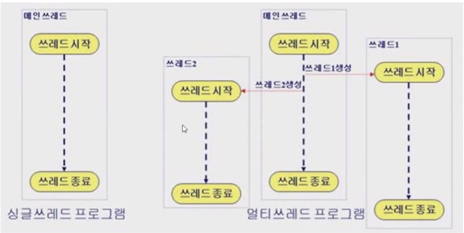

# Thread

[Thread](*Thread)
[Runnable](*Runnable)
[Volatile](*Volatile)
[Synchronziation](*Synchronization)

### Thread
쓰레드 : 동시 진행, 동시에 여러 가지 작업을 진행. 프로그램의 흐름.​

두 가지 이상의 일을 동시에 실행하기 위해서 사용되는것을 멀티 쓰레드 (Multithread) 라고 한다.

동시에 진행되지는 않지만, 작은 간격으로 일을 번갈아 실행하는 것이며, 시간과 순서는 하드웨어나 시스템에 따라 바뀔 수 있다.

Multithread는 모든 프로그램이 끝나야지 쓰레드가 종료 된다.
<br>
쓰레드를 구현하기 위해서는 Thread 클래스를 상속받는 클래스를 만들고,

public의 접근 제한자를 가진 Run 메소드를 만들고 그 안에 실행할 작업들을 명시한다.

```java
public class MyThread extends Thread {
    @Override
    public void run() {                                  // 쓰레드 구현
        for (int i = 0; i < 50; i++) {  
            System.out.println("쓰레드: " + i);
        }
    }
}


public class Control {
    public void init() {
        MyThread th = new MyThread();
//        th.run();                                      // 잘못된 방식
        th.start();                                      // 쓰레드 실행
        for (int i = 0; i < 50; i++) {
            System.out.println("컨트롤: " + i);
        }
    }
}
```

```java
NewThread th = new NewThread();
th.start();
// th.run();        // 옳지 않은 방식
```

--- 

### Runnable
```java
public class RunThread implements Runnable {
    @Override          // 무조건 오버라이드를 사용
    public void run() {
        for (char c = 'a'; c < 'z'; c ++) {
            System.out.println(c);
        }
    } 
}


Thread thread = new Thread(new RunThread());
thread.start();
```

즉, 상속을 받고 쓰레드도 쓰고 싶을때 Runnable을 사용.
```java
public class MyThread extends Person implements Runnable {
    ...
}
```

--- 

### Volatile
volatile : 뜨레드 중간에는 값이 계속 변할 수 있다. 그래서 메모리 안의 값을 직접 확인하게 한다. (속도는 좀 더 느려짐)

```java
volatile boolean isTrue;         // 20200901_MyThread3
```

--- 

### Synchronization
동기화,
thread 사이 사이에 값이 바뀌어서 원하는 값이 안나올 수 도있다. 

그래서 data를 보존 하기 위해 동기화를 해주는데, 그것을 가지고 synchronization 이라고 한다.

```java
//메소드에 사용
public synchronize void method () {
    ... 
}
```
```java
//객체 변수에 사용
public void run() {
    synchronize(var) { 
        ...
    }
}
```
※ 프로그램을 잠시 기다리고 막는 역할을 함으로서, 너무 많은 너무 큰 동기화는 오히려 성능을 낮출수도 있다.

**Example**
```java
TransferThread th1     = new TransferThread();
CheckBalanceThread th2 = new CheckBalanceThread();
        
th1.start();
th2.start();
@Override
public void run() {
    for (int i = 0; i < 3; i++) {
        synchronized (share) {                                          // 동기화
            int sum = share.ac1.money + share.ac2.money;                // 간섭하기
            System.out.println("총 금액 : " + sum);
        }
            
        try {
            Thread.sleep(1);
        } catch (InterruptedException e) {
            e.printStackTrace();
        }
    }
}
```