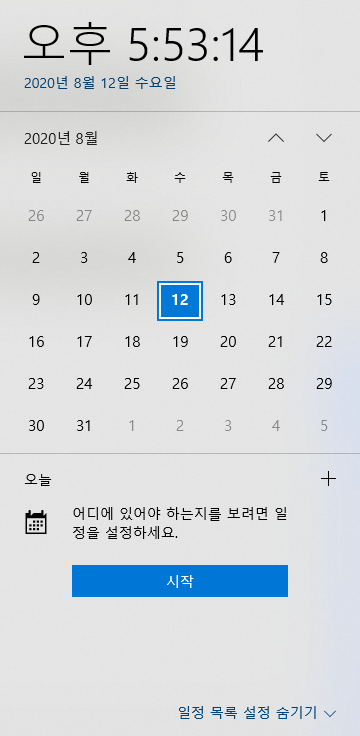

# Date, Calendar

---
 
## Date
***자바는 날짜를 사용할 수 있는 library가 있다.***

```java
import java.util.Date;                     // import
Date date = new Date();

String s = date.toString();                   // Wed Aug 12 17:20:58 KST 2020
import java.text.SimpleDateFormat
SimpleDateFormat sdf
sdf = new SimpleDateFormat("yyyy년 MM월 dd일");
System.out.println(sdf.format(date));                     // 2020년 08월 12일

sdf = new SimpleDateFormat("G-y-M-d");
System.out.println(sdf.format(date));                     // 서기-2020-8-12
```

[Simple Date Format을 더 확인하세요](https://everlikemorning.tistory.com/entry/SimpleDateFormat-%ED%8C%A8%ED%84%B4%EB%B0%8F-%EC%82%AC%EC%9A%A9%EC%98%88%EC%A0%9C)


```java
import java.text.SimpleDateFormat;
import java.util.Date;

public class Main {

    public static void main(String[] args) {
        Date date = new Date();

        SimpleDateFormat sdf0, sdf1, sdf2, sdf3, sdf4, sdf5, sdf6, sdf7, sdf8, sdf9;

        sdf0 = new SimpleDateFormat("yyyyMMdd");
        sdf1 = new SimpleDateFormat("yyyy-MM-dd");
        sdf2 = new SimpleDateFormat("yy년 MM월 dd일 E요일");
        sdf3 = new SimpleDateFormat("yyyy-MM-dd HH:mm:ss.SSS");
        sdf4 = new SimpleDateFormat("yyyy-MM-dd hh:mm:ss a");
        sdf5 = new SimpleDateFormat("오늘은 올 해의 D번째 날입니다.");
        sdf6 = new SimpleDateFormat("오늘은 이 달의 d번째 날입니다.");
        sdf7 = new SimpleDateFormat("오늘은 올 해의 w번째 주입니다.");
        sdf8 = new SimpleDateFormat("오늘은 이 달의 W번째 주입니다.");
        sdf9 = new SimpleDateFormat("오늘은 이 달의 F번째 E요일 입니다.");

        System.out.println(sdf0.format(date));    // 20200812
        System.out.println(sdf1.format(date));    // 2020-08-12
        System.out.println(sdf2.format(date));    // 20년 08월 12일 수요일
        System.out.println(sdf3.format(date));    // 2020-08-12 17:35:08.921
        System.out.println(sdf4.format(date));    // 2020-08-12 05:35:08 오후
        System.out.println(sdf5.format(date));    // 오늘은 올 해의 225번째 날입니다.
        System.out.println(sdf6.format(date));    // 오늘은 이 달의 12번째 날입니다.
        System.out.println(sdf7.format(date));    // 오늘은 올 해의 33번째 주입니다.
        System.out.println(sdf8.format(date));    // 오늘은 이 달의 3번째 주입니다.
        System.out.println(sdf9.format(date));    // 오늘은 이 달의 2번째 수요일 입니다.
    }
}

```

---
 
 ## Calendar

 ```java
 import java.util.Calendar;
 ```

 ```java
Calendar cal = Calendar.getInstance();
int year  = cal.get(Calendar.YEAR);
int month = cal.get(Calendar.MONTH);   // 0 - 11
int day   = cal.get(Calendar.DATE);
int dow   = cal.get(Calendar.DAY_OF_WEEK); // 1-일요일, 2-월요일, .. 7-토요일
int max   = cal.getActualMaximum(Calendar.DATE);   // cal 기준으로 제일큰 DATE, (31일.
int maxM  = cal.getActualMaximum(Calendar.MONTH); // 12
		
System.out.println(year);             // 2020
System.out.println(month);            // 7 (현재 8월)
System.out.println(day);              // 12 (현재 12일)
System.out.println(dow);              // 4 (현재 수요일)
System.out.println(max);              // 31
```

### add
```java
cal.add(Calendar.MONTH, -1);              // 2020-08-12 --> 2020-07-12
cal.add(Calendar.MONTH, 2);               // 2020-08-12 --> 2020-09-12
```
### set
```java
cal.set(Calendar.YEAR, 2000);             // 2020-09-12 --> 2000-09-12
```

--- 

## 달력


```java
import java.text.SimpleDateFormat;
import java.util.Calendar;
import java.util.Date;
import java.util.Scanner;

public class Main {
    public static void main (String[] args) {
        
        Calendar cal = Calendar.getInstance();

        Scanner scan = new Scanner(System.in);
        String inputDate;
        
        while (true) {
            int yy = 0;
            int MM = 0;
            
            while (true) {
                System.out.print("오늘의 달력을 보기 위해, 년, 월을 입력하세요 (yyyy/MM):   ");
                inputDate = scan.nextLine();
                
                if (inputDate.indexOf("-") != -1) {
                    yy = Integer.parseInt(inputDate.substring(0, inputDate.indexOf("-")));
                    MM = Integer.parseInt(inputDate.substring(inputDate.indexOf("-") + 1));
                    break;
                } else {
                    continue;
                }
            }
            
            
            cal.set(Calendar.YEAR, yy);
            cal.set(Calendar.MONTH, MM - 1);
                            
            int calendarSize;
        
            int currMonth = cal.get(Calendar.MONTH);  		// 7  (8월)
            int currMax = cal.getActualMaximum(Calendar.DATE);  // 31일
            
            
            // 이전 달
            cal.set(Calendar.DATE, 1);						// 8-1
            int currDate  = cal.get(Calendar.DAY_OF_WEEK);  // 수요일이면 4
            int prevDiff  = currDate - 1;
            
            
            cal.add(Calendar.DATE, -1);
            int prevMax   = cal.get(Calendar.DATE);         // 일요일 사이 기간 확인
            
            
            
            // 다음 달
            cal.add(Calendar.DATE, 1);
            cal.set(Calendar.DATE, currMax);
            int nextDate = cal.get(Calendar.DAY_OF_WEEK);  // 날짜 확인
            int nextDiff = 7 - nextDate;                   // 토요일 사이 기간 확인
            
            
            calendarSize = (currMax + prevDiff + nextDiff);

            int[] calendar = new int[calendarSize];
            cal.set(Calendar.DATE, 1);
            cal.add(Calendar.DATE, -prevDiff);
            
            System.out.println(yy + "년   " + MM + "월");
            for (int i = 0; i < calendarSize; i ++) {
                calendar[i] = cal.get(Calendar.DATE);
                if (i % 7 == 0) {
                    System.out.println();
                }
                System.out.print(cal.get(Calendar.DATE) + "  ");
                
                cal.add(Calendar.DATE, 1);
            }
            
            
            System.out.print("\n\n Continue (Y/N): ");
            String input = scan.nextLine();
            
            if (input.equals("Y") || input.equals("y")) continue;
            else break;
        }
    }
}
```